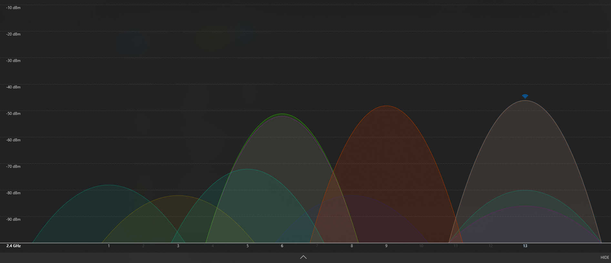

# Projekt: Samostatné zapojení a konfigurace síťového routeru

## Cíl
Cílem tohoto projektu je prokázat, že jsem schopen samostatně zapojit,
nakonfigurovat a otestovat domácí síťový router. V rámci projektu jsem se
seznámil se základními hardwarovými a softwarovými prostředky používanými
v oblasti počítačových sítí, pochopil jsem princip fungování bezdrátových
sítí (Wi-Fi) a význam jednotlivých konfiguračních parametrů routeru.

Součástí cíle je také:
- orientace v administraci síťového zařízení,
- pochopení rozdílů mezi pásmy 2.4 GHz a 5 GHz,
- ověření správné funkčnosti sítě na různých zařízeních.

---

## Ověření cílů
- Zapojil jsem router do elektrické sítě a k poskytovateli internetu  
- Přihlásil jsem se do administračního rozhraní routeru  
- Nakonfiguroval jsem LAN a bezdrátové sítě  
- Nastavil jsem zabezpečení Wi-Fi  
- Ověřil jsem funkčnost připojení na PC a mobilním telefonu  

---

## 1. Použité hardwarové prostředky
- Síťový router **TP-Link Archer C6**
- Napájecí adaptér routeru
- Ethernetový kabel (UTP)
- Stolní počítač a notebook
- Mobilní telefon

### Základní popis routeru
Router je zařízení, které propojuje lokální síť s internetem. Zajišťuje
směrování dat, přidělování IP adres (DHCP), zabezpečení sítě a bezdrátovou
komunikaci pomocí Wi-Fi.

---

## 2. Zapojení routeru
Router jsem připojil k elektrické síti pomocí napájecího adaptéru. WAN port
routeru jsem propojil ethernetovým kabelem s modemem poskytovatele internetu.
Pro první konfiguraci jsem počítač připojil k routeru pomocí LAN kabelu,
aby byla zajištěna stabilní komunikace během nastavování. Po zapnutí routeru
jsem zkontroloval stavové LED diody.

---

## 3. Přihlášení do administrace routeru
Do administrace routeru jsem se přihlásil pomocí webového prohlížeče na adrese  
**http://192.168.0.1** pomocí lokálního administračního hesla.  
Při resetu routeru do továrního nastavení bylo nutné nové heslo znovu vytvořit.

---

## 4. Softwarové prostředky
Nastavil jsem parametry lokální i bezdrátové sítě tak, aby router automaticky
přiděloval IP adresy, síť byla zabezpečená a všechna zařízení měla stabilní
připojení k internetu.

---

## 5. Konfigurace bezdrátové sítě (Wi-Fi)

### Nastavení 2.4 GHz
- Režim: 802.11 b/g/n mixed  
- Kanál: 13  
- Šířka kanálu: 20 MHz  
- Zabezpečení: WPA2-PSK (AES)  

Pásmo 2.4 GHz jsem zvolil kvůli lepšímu dosahu a stabilitě připojení.

### Nastavení 5 GHz
- Režim: 802.11 a/n/ac mixed  
- Kanál: 36  
- Šířka kanálu: 80 MHz  
- Zabezpečení: WPA2-PSK (AES)  

Pásmo 5 GHz jsem nastavil kvůli vyšší rychlosti připojení na stolním počítači.

---

## 6. Zabezpečení sítě
Pro zabezpečení bezdrátové sítě jsem použil:
- šifrování WPA2-PSK,
- silné heslo,
- oddělené názvy sítí pro 2.4 GHz a 5 GHz.

Tím je zabráněno neoprávněnému přístupu do sítě.

---

## 7. Testování funkčnosti

### Měření rychlosti – Wi-Fi 2.4 GHz (bezdrátově)
Měření jsem provedl pomocí nástroje Speedtest by Ookla. Toto pásmo nabízí lepší
dosah, ale nižší přenosové rychlosti.

### Měření rychlosti – Wi-Fi 5 GHz (bezdrátově)
Pásmo 5 GHz poskytuje vyšší rychlosti připojení, což se potvrdilo i při měření.

### Měření rychlosti – kabelové připojení
Kabelové připojení sloužilo jako referenční hodnota, protože není ovlivněno
rušením bezdrátového signálu.

---

## 8. Analýza obsazení Wi-Fi kanálů (panelový dům)
Protože se router nachází v panelovém domě, provedl jsem analýzu obsazenosti
Wi-Fi kanálů pomocí aplikace WiFi Analyzer. Na základě výsledků jsem zvolil
méně rušený kanál, čímž se zlepšila stabilita připojení.

---

## 9. Problémy a jejich řešení
Během konfigurace jsem narazil na problém s připojením počítače k 5 GHz síti.
Mobilní telefon fungoval bez problémů, ale počítač se nepřipojoval. Problém
jsem vyřešil změnou nastavení zabezpečení a pevného kanálu. Díky tomu jsem
pochopil, že je nutné brát v úvahu kompatibilitu různých zařízení.

---

## 10. Hodnocení projektu a sebereflexe
Projekt hodnotím jako přínosný, protože mi umožnil prakticky si vyzkoušet práci
se síťovým zařízením. Naučil jsem se systematicky řešit problémy a ověřovat
funkčnost sítě pomocí reálných měření.

Při práci jsem využil odborné internetové zdroje a konzultoval postup také
pomocí nástroje ChatGPT jako studijní pomůcky. Samotné zapojení, konfiguraci
a testování routeru jsem provedl samostatně.

---

## Citace
[1] BEHFOR. *Choose the Right Channel for your WiFi!*. Online. YouTube, 2023.  
Dostupné z: https://www.youtube.com/watch?v=S_RO92ttpMo  
[cit. 2025-12-17].

[2] *Jak nastavit router TP-LINK – návod*. Online. YouTube, 2024.  
Dostupné z: https://www.youtube.com/watch?v=8hMrZ6RmAjc  
[cit. 2025-12-18].

[3] OpenAI. *ChatGPT – konzultační dotaz k nastavení routeru*. Online, 2025.  
[cit. 2025-12-18].

---

## Závěr
V tomto projektu jsem samostatně zapojil a nakonfiguroval domácí síťový router.
Projekt splnil stanovené cíle a pomohl mi lépe pochopit základy počítačových sítí.
